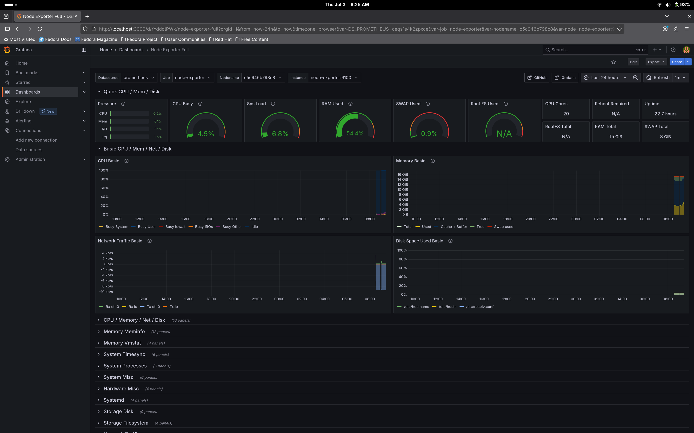

# 🖥️ System Health Dashboard

A DevOps project to monitor your local system using Prometheus, Node Exporter, and Grafana with Docker Compose.

## 📦 Stack
- Prometheus
- Node Exporter
- Grafana
- Docker Compose

## 🚀 Getting Started
```bash
git clone https://github.com/kardebayan/system-monitoring-dashboard.git
cd system-monitoring-dashboard
docker compose up -d
```

## 📸 Screenshot

Here’s what the Grafana dashboard looks like:

